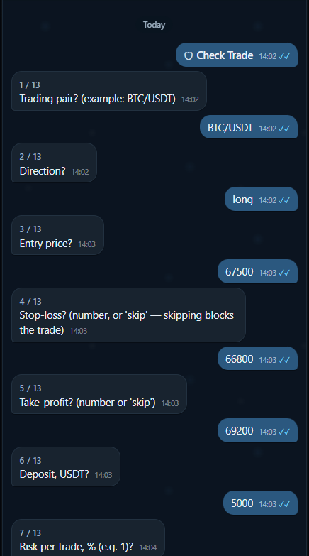
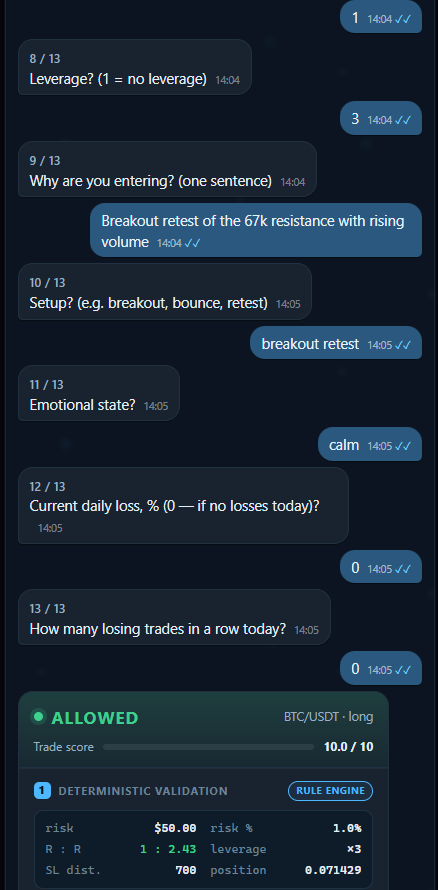
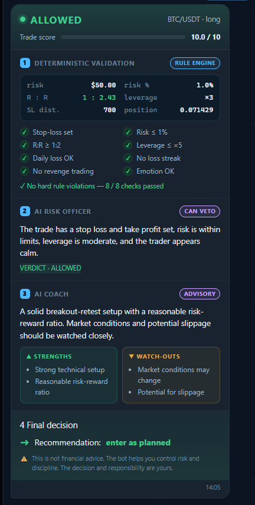

<div align="center">

# Risk Discipline Assistant

### Deterministic crypto risk controls with an AI layer that can explain or veto — never override the rules.

[](https://www.python.org/)
[](https://fastapi.tiangolo.com/)
[](https://www.postgresql.org/)
[](https://flutter.dev/)
[](https://github.com/raianbagautdinov95/risk-discipline-assistant/actions/workflows/tests.yml)
[](LICENSE)

</div>

Risk Discipline Assistant is a portfolio-grade risk-management platform for crypto traders. Every proposed trade passes through deterministic validation before any LLM is consulted. An AI Risk Officer may add a veto, while an AI Coach explains the decision and highlights behavioral risks.

The result is a clear safety boundary: language models contribute context and coaching, but business rules remain predictable, testable, and authoritative.

> This project supports analysis and trading discipline. It does not execute trades and is not financial advice.

## Decision architecture

```text
Structured trade questionnaire
            |
            v
Deterministic risk engine  -----> can block
            |
            v
AI Risk Officer            -----> may add a veto; cannot approve a blocked trade
            |
            v
AI Coach                   -----> advisory explanation and psychology feedback
            |
            v
Final decision + journal record
```

The rule engine checks eight blocking conditions implemented in code:

1. stop-loss presence
2. maximum risk per trade
3. leverage limit
4. minimum risk-to-reward ratio
5. daily-loss protection
6. consecutive-loss protection
7. emotional-state validation
8. revenge-trading detection

See [`docs/ARCHITECTURE.md`](docs/ARCHITECTURE.md) for the reasoning behind the veto model, provider abstraction, service split, voice input, and deterministic rule layer.

## Product flow

| Guided input | Structured context | Explainable result |
| --- | --- | --- |
|  |  |  |

The Flutter client collects trade context through a guided questionnaire, sends it to the discipline backend, and presents the rule checks, AI review, coaching feedback, and final recommendation as separate layers.

## Platform components

| Path | Component | Responsibility |
| --- | --- | --- |
| [`crypto-discipline-bot/`](crypto-discipline-bot/) | Discipline backend + Telegram bot | FastAPI, aiogram, deterministic rules, AI review, journal, statistics, and voice input |
| [`flutter_app/`](flutter_app/) | Flutter Web dashboard | Trade checks, journal, statistics, and signal UI |
| [`ai/`](ai/) | Signal engine | Indicators, chart-pattern detection, and LLM-assisted market analysis |
| [`main.py`](main.py), [`api.py`](api.py) | Signal scanner and API | Periodic market analysis, REST access, and notifications; no order execution |
| [`monitoring/`](monitoring/) | Monitoring | Signal tracking, reporting, and notifications |
| [`backtest.py`](backtest.py) | Backtesting | Replays signal logic over historical market data |

The signal scanner and discipline backend are separate HTTP services, so analysis and trade validation can be deployed independently.

## What is implemented

- Async FastAPI discipline backend and aiogram Telegram bot
- PostgreSQL persistence through async SQLAlchemy and Alembic migrations
- Deterministic rule and final-decision engines with unit tests
- OpenAI, Anthropic, and Ollama behind a provider abstraction
- Local inference option through Ollama
- OpenAI Whisper voice input
- Trade journal and statistics endpoints
- Flutter Web client
- Standalone market scanner, notifications, and historical backtesting
- Docker Compose development environment
- GitHub Actions test workflow

## Quick start: discipline backend

Requirements: Docker and Docker Compose.

```bash
cd crypto-discipline-bot
cp .env.example .env
# Configure BOT_TOKEN and an AI provider, or point the app to Ollama.

docker compose up --build
```

- Swagger UI: [http://localhost:8009/docs](http://localhost:8009/docs)
- PostgreSQL: `localhost:5433`

Apply migrations or run tests inside the backend directory:

```bash
alembic upgrade head
pytest
```

For local inference, configure `OLLAMA_BASE_URL`; cloud AI credentials are not required when the Ollama provider is selected.

## Run the signal scanner

From the repository root:

```bash
python -m venv .venv
source .venv/bin/activate          # macOS / Linux
# .\.venv\Scripts\Activate.ps1   # Windows PowerShell

pip install -r requirements.txt
python main.py --once              # one scan
python main.py                     # continuous scanning
```

## Tech stack

| Layer | Technology |
| --- | --- |
| Backend | Python 3.11, FastAPI, Uvicorn, Pydantic v2 |
| Bot | aiogram 3 |
| Data | PostgreSQL 16, SQLAlchemy 2.0 async, Alembic |
| AI | OpenAI, Anthropic, Ollama, Whisper |
| Market analysis | pandas, NumPy, `ta` |
| Frontend | Flutter Web / PWA |
| Delivery | Docker, Docker Compose, GitHub Actions |

## Engineering highlights

- Hard separation between probabilistic AI output and deterministic policy
- AI provider independence, including a local-inference path
- Explainable decisions: rule results, veto, and coaching remain visible as distinct layers
- Two independently deployable backends in one domain-oriented monorepo
- Tests focused on the safety-critical rule and decision engines

## Production boundaries

The repository includes containerized services, migrations, async persistence, provider abstractions, OpenAPI documentation, and CI. Authentication, rate limiting, distributed task processing, centralized observability, and hardened secret management remain future production work.

## Author

Built by [Raian Bagautdinov](https://github.com/raianbagautdinov95), a Python Backend / AI Automation / SaaS Engineer focused on reliable AI systems in which software rules — not model output — remain the source of truth.

## License

[MIT](LICENSE)

